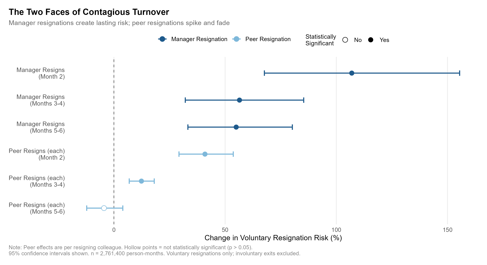
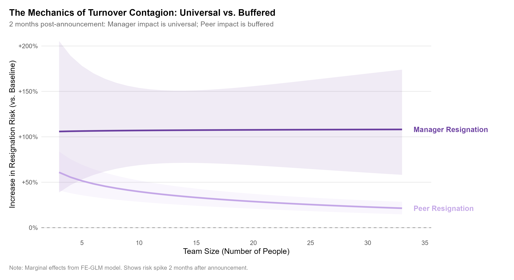
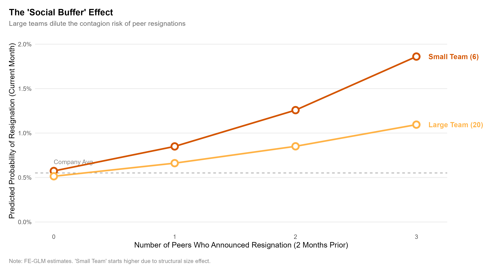

Recently, I dug into the well-known phenomenon of “*contagious turnover*” and found some compelling - and sobering - results.

I was particularly curious about whose resignation is most strongly associated with subsequent departures: team peers or direct managers? And can team size really act as a buffer? To get a handle on this, I analyzed voluntary attrition patterns using a *fixed-effects cloglog discrete-time survival model*\*, crunching 2.7M+ person-month observations.

**Short intro methodological note**: I didn’t just look at who *left* today. I adjusted the model to account for a two-month notice period. This allowed me to separate the **Decision Phase** (when the news breaks) from the **Departure Phase** (when the seat actually goes empty).

Now, the major findings…

{width=100%}

### **Manager Resignation: The “Universal Shock” & “The Long Tail”**
Manager departures show a distinctive pattern over time, and team size appears to moderate this relationship in unexpected ways.

**The Universal Shock (Month 2)**:
 When a direct manager announces they are leaving, the estimated risk of their team members quitting is **107% higher exactly two months later**. Crucially, there is no evidence that team size offers protection here. The model shows that the immediate “panic” is universal - a manager leaving a squad of 3 is associated with the same massive spike in attrition risk as a manager leaving a department of 20.
 
**The Paradox of Scale (Months 3–4)**:
 As the initial shock fades, a strange pattern emerges. While the average risk remains elevated (+56%), there are tentative hints that *large teams may be more vulnerable* during this period. This could be interpreted as a “**structural vacuum**” effect: without a leader to manage the complexity of a large unit, the environment may degrade faster than in a small, self-organizing squad.

**The Long Tail (Months 5–6)**:
 By this point, the acute crisis is over, but the baseline risk remains elevated at +55%, regardless of team size. This persistence suggests that the issue has shifted from an acute reaction to a more chronic structural problem - though we cannot rule out that both the manager’s departure and the team’s attrition share a common cause.

{width=100%}

 
### **Peer Resignation: The “Flash Flood”**
Peer resignations show a very different profile, consistent with the idea that they act more as *social signals* than structural failures.

**The Social Panic (Month 2)**:
 Like manager exits, peer resignations are associated with a sharp spike in risk - roughly **41% higher per departing peer** - around the time the peer actually leaves.
 
**The Buffer Effect**:
 Unlike the manager scenario, team size does help here - but only in the acute phase. The model shows a clear dilution effect in Month 2: the larger your team, the less each departing peer affects overall risk. This buffering effect fades in later months and is no longer statistically detectable by Months 3–6. This supports the “**social buffering**” hypothesis: in a small team, one peer leaving is a major disruption to the social fabric; in a large team, the effect is diluted.

**The Quick Recovery (Months 3–6)**:
 Unlike the manager effect, the peer contagion signal decays rapidly. The estimated risk drops to just 12% in Months 3–4 and becomes negligible by Months 5–6. This rapid decay is consistent with the notion that peer contagion is an acute, short-lived phenomenon rather than a long-term structural degrader.

{width=100%}

### **The Takeaway**
If these patterns reflect genuine causal relationships (see the methodology section below), “*contagious turnover*” may not be a single problem, but two distinct challenges:

1. **The Peer Exodus**: This looks like an acute, social fire. It spreads fast - and burns out fast. The data imply that if you survive the first few months, the danger likely passes.Possible actions: Counter-signal immediately. If this is an information cascade, you need to break the signal chain. Launch targeted *stay conversations* with central influencers (social nodes) within days. The goal is narrative control: stop the “sinking ship” rumor before it solidifies.
2. **The Manager Vacuum**: This appears to be a more chronic, structural failure that may actually worsen with scale in the medium term. The short-term risk is universal, and large teams may struggle disproportionately without clear direction - though this needs further validation. This supports the case for rapid stabilization: uncertainty causes more damage than an imperfect leader. Install a designated interim immediately to hold the structural load. Large teams cannot self-organize through a transition; they require visible continuity to prevent the environment from degrading.

Curious if this matches what you’ve seen on the ground.

### **The “Elephant in the Room” (Limitations)**
Let’s be honest about the biggest potential hole in this analysis: **team-level time-varying shocks**. While I controlled for organization and time fixed effects, the model cannot definitively distinguish between *contagion* (one person leaving triggers others) and *common shocks* (a bad environment pushes everyone out).

* **The Manager Illusion**: If the ship is sinking, the captain often jumps first - because they have better binoculars. The crew jumping later may look like they’re following the leader, but they may simply be reacting to the same sinking ship.
* **The Peer Illusion**: Similarly, if two teammates leave in quick succession, it might not be that Peer A influenced Peer B. More often, they share the same toxic boss or failing project - and Peer A just found a new job 30 days faster.

To strengthen the conclusions in future iterations, the gold standard would be an exogeneity filter: rerunning the model using only exits driven by plausibly random shocks (retirements, partner relocations, etc.). If the attrition spike persists when a colleague leaves for “neutral” reasons, we’d have stronger evidence of true social contagion. If the spike vanishes, we were likely measuring a *bad culture proxy*. That said, this approach has its own limitations - such exits are rare and may not generalize well.

🤓 Has anyone here run similar analyses - internally or in research? If so, I’m curious what modeling approach you used and whether your results pointed in the same direction.

------

* **Methods note**: Fixed-effects cloglog discrete-time survival model was used. Resignation predictors are lagged to align with a standard two-month notice period. Peer resignations are modeled as counts. The model controls for tenure, age, gender, management level, and team size (logged and centered), with fixed effects for org unit, region, job family group, and reporting date, and standard errors clustered by team. Involuntary exits are treated as competing events via cause-specific hazards (right-censored). **All effect sizes should be interpreted as associations, not causal estimates**.
