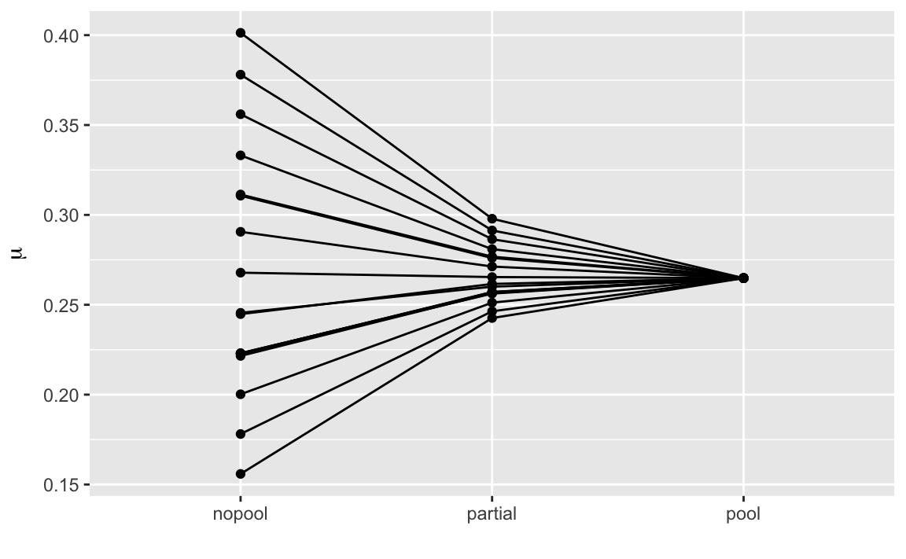

How are you planning to handle the statistical analysis for EUPTD pay gap reporting - especially for small worker categories?

The directive requires reporting by category of workers. Some of those groups will inevitably be thin (5–30 people). A standard OLS regression 
$$log(pay) ~ gender + controls$$

on a group that small gives you a gender coefficient you can barely trust.

I've been thinking about partial pooling - hierarchical models that borrow strength across categories. Small groups get pulled toward the overall estimate; large groups keep their own. It's a well-established technique, but I haven't seen much discussion of it in the pay equity space.

{width=100%}

*An illustration of how shrinkage works in hierarchical modeling across three pooling strategies. No-pooling treats each group independently, producing the highest variance in estimates. Partial pooling shrinks group-level estimates toward the global mean—balancing group-specific signal with overall trends. Complete pooling collapses all groups to a single estimate, eliminating between-group variance entirely. The vertical axis shows the estimated μ for each group; the horizontal axis compares the three approaches.*

The interesting tension: shrinkage could pull a group's gap below the 5% JPA trigger threshold. Is that a feature (better estimation) or a bug (masking real gaps)? 🤔

Also curious whether anyone is considering Bayesian approaches. Getting a direct probability that the gap exceeds 5% feels much more useful than a binary significant/not-significant answer from frequentist regression.

Would love to hear:

* What methodology you're planning
* How you're handling categories with few employees
* Whether you're distinguishing between internal analysis and regulatory reporting methodology

June 2027 is closer than it looks 😉
