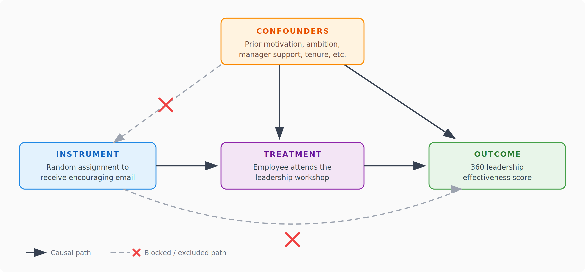

This post can be seen as a follow-up to the [article](https://blog-about-people-analytics.netlify.app/posts/2025-05-21-causal-inference-in-people-analytics/){target="_blank"} Cole Napper and I wrote on the use of causal inference methods in the People Analytics space. One of its sections discusses instrumental variables (IV) as a very useful and powerful - but also often very hard to find - method for estimating causal effects.

For those less familiar with IV, here's the super-short version: instead of directly comparing participants with non-participants (which is usually biased), we look for a variable that shifts the probability of participating while being otherwise unrelated to the outcome. That variable then gives us a cleaner estimate of the causal effect - typically for the subgroup of people whose behavior was actually changed by that "push."

While reading a paper on using IV to estimate causal effects in situations where not everyone assigned to the treatment group actually complies with the assigned program, it hit me (yes, I know I'm late to the party - nobody's perfect 😊) that treating assignment not as treatment itself, but merely as encouragement, can be relatively easily utilized in the People Analytics world.

Rather than randomly granting or denying access to a program - which would often be neither practical nor especially ethical in an HR context - we randomly select a subset of eligible employees to receive a targeted email (or another type of nudge) encouraging them to participate. The remaining eligible employees still have full access to the program; they just do not receive that specific encouragement.

{width=100%}

By comparing outcomes between the encouraged and non-encouraged groups, and using random encouragement assignment as an instrumental variable for actual participation, we can estimate the causal effect of the program for those employees whose participation was actually driven by the encouragement.

This convenience doesn't come without a price, though. We scale down from estimating the *Average Treatment Effect* (ATE) across the entire population to a *Local Average Treatment Effect* (LATE), also known as the *Complier Average Causal Effect* (CACE) - the effect specifically on those who participated because of the encouragement, not on everyone.

Moreover, the validity of the LATE estimate rests on several assumptions that shouldn't be taken for granted. First, the exclusion restriction: the instrument (in our case, the encouraging email) must affect outcomes only through its influence on participation, not through any other channel. In practice, this means the email itself shouldn't, for example, boost employee morale or signal managerial support in a way that independently shifts the outcome we're measuring. Second, monotonicity - or the "no defiers" assumption: the nudge shouldn't cause anyone to do the opposite of what's intended. In an HR context, this is worth thinking about seriously - if some employees see a corporate nudge and reflexively disengage, the estimate breaks down. And third, relevance: the instrument has to actually move the needle on participation. If the nudge barely changes sign-up rates, you're dealing with a weak instrument, and your estimates become extremely noisy and unreliable.

Still, even with these caveats, we preserve voluntary participation, avoid withholding opportunities from anyone, and get evidence that is much more credible than simple
before–after comparisons or naive participant-versus-non-participant analyses.

If you want a good sense of how an encouragement design can be set up in a real-world business setting, check out, for example, the [paper by Castro et al. (2022)](https://www.researchgate.net/publication/361765374_Fostering_Psychological_Safety_in_Teams_Evidence_from_an_RCT){target="_blank"}. They report a randomized field experiment in a large global healthcare company with 1,000+ teams and 7,000+ employees, where managers were randomly encouraged to hold specific types of 1:1 conversations to improve psychological safety. Note that their primary analysis uses an *intent-to-treat* (ITT) framework rather than IV/LATE, but the experimental structure itself is a great illustration of how randomized encouragement can be deployed at scale in a corporate environment.*

❓ Curious whether anyone in my People Analytics network has been using encouragement designs (or similar IV-based approaches) when tackling causal estimation - I'd love to hear how it went in practice.

----

\* **A note on ITT vs. IV/LATE**: Both approaches answer different causal questions using the same encouragement design setup. ITT asks what the causal effect of being encouraged is, regardless of whether the person actually participated - you simply compare average outcomes between the encouraged and non-encouraged groups. Because assignment is random, this comparison is unbiased with no assumptions beyond randomization needed, but it comes at a cost: if only 30% of the encouraged group actually participates, you're averaging a real treatment effect for those 30% with a zero effect for the 70% who ignored the nudge, yielding a clean but diluted estimate. IV/LATE, by contrast, asks what the causal effect of actually participating is for the people whose participation was changed by the encouragement (the compliers) - it essentially takes the ITT estimate and scales it up by the compliance rate (the Wald estimator: ITT effect divided by the first-stage effect on participation), giving you an undiluted effect, but only for compliers, and only if all three assumptions hold (exclusion restriction, monotonicity, and relevance). The tradeoff in a sentence: ITT is less informative but basically bulletproof; IV/LATE is more informative but fragile.

