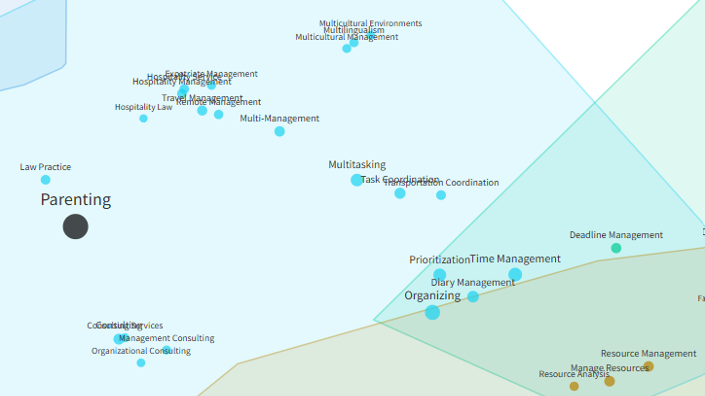
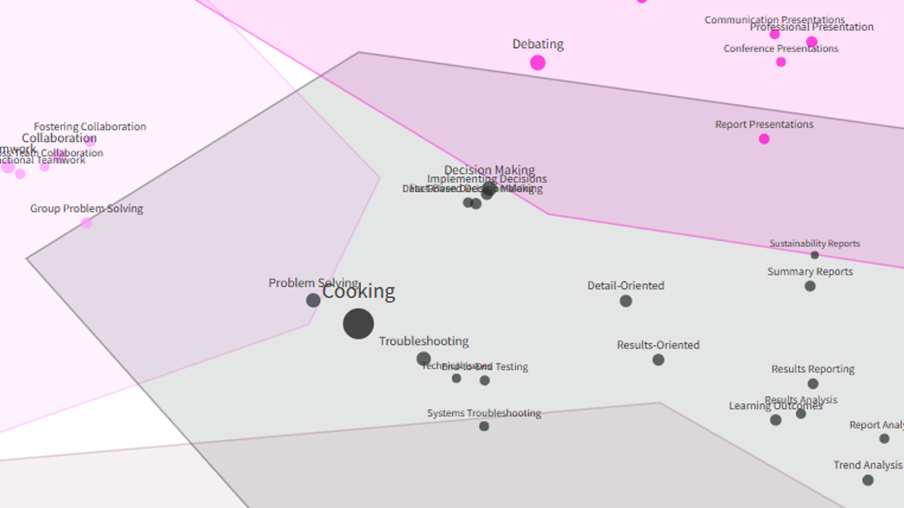

While stress-testing a team skills app, just for fun I tried searching in the semantic space of existing business skills for everyday activities like parenting and cooking.

Check out where these two landed in the attached pics. Does it resonate? 🙃 For me it’s pretty accurate 😅

{width=100%}

{width=100%}

