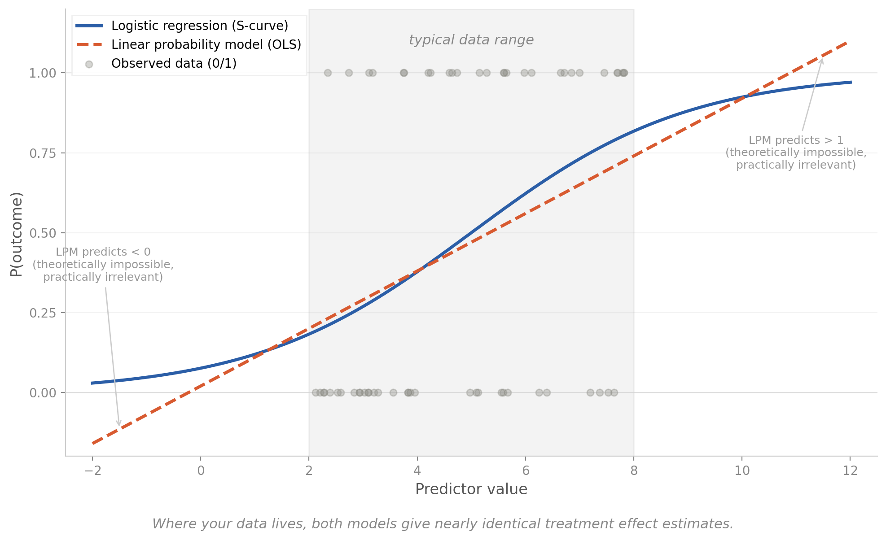

In psychology, few things are drilled into you harder than: "Binary outcome? Use logistic regression. Never OLS. Never ever."

I carried this rule for years like a sacred commandment. Then I started working on causal inference - evaluating program effects, matching, treatment estimates - and discovered that the entire applied causal inference field happily runs OLS on binary outcomes under the fancy name: *Linear Probability Model*.

At first it felt like watching someone pour red wine into a coffee mug. Technically functional, deeply unsettling. But here's why it actually may make sense in this context:️

* You're not predicting, you're estimating. When you care about one number - "how much did this program change the probability of outcome X" - OLS gives you that directly as a coefficient. Logit gives you a log-odds coefficient that you then need to transform into a probability difference via post-estimation (average marginal effects). In many practical settings, both give you comparable answers - but OLS skips the extra step.
*️ It doesn't blow up so easily. With small samples, many categorical controls, and sparse cells, logit loves to produce infinite coefficients, NaNs, and complete separation drama.️
* The coefficient is human-readable. "Participants were 3 percentage points more likely to move internally" vs "the log-odds ratio was 0.47." One of these gets a nod in a stakeholder meeting. The other gets a blank stare.️
* It's not just some hack. Angrist & Pischke basically made it the default in Mostly Harmless Econometrics. Imbens & Rubin cover it. The entire economics causal inference tradition uses it routinely. You add robust standard errors (HC1) for simple designs - with matching or clustering, you may need to adjust the variance estimator further.️
* The limits are real - and worth knowing. LPM can predict probabilities below 0 or above 1. If you're building a risk scoring model, that matters. If you're estimating an average effect from a matched sample, it usually doesn't - but one shouldn't stop there. When baseline rates are very high or very low, when you're estimating interaction effects, or when covariate relationships are strongly nonlinear, LPM and logit can diverge meaningfully. Out-of-bounds predictions are your canary: if you're seeing them, check whether the linear approximation is actually holding up. The point is to know when it breaks.

{width=100%}

The deeper lesson for me: the real question isn't "OLS vs logit." It's "what estimand do you want?" Risk difference → LPM is often the natural fit. Odds ratio → logistic regression. Risk ratio → log-binomial or modified Poisson. The tool follows the question, not the other way around.

Seems that sometimes sin is the way 🙃
