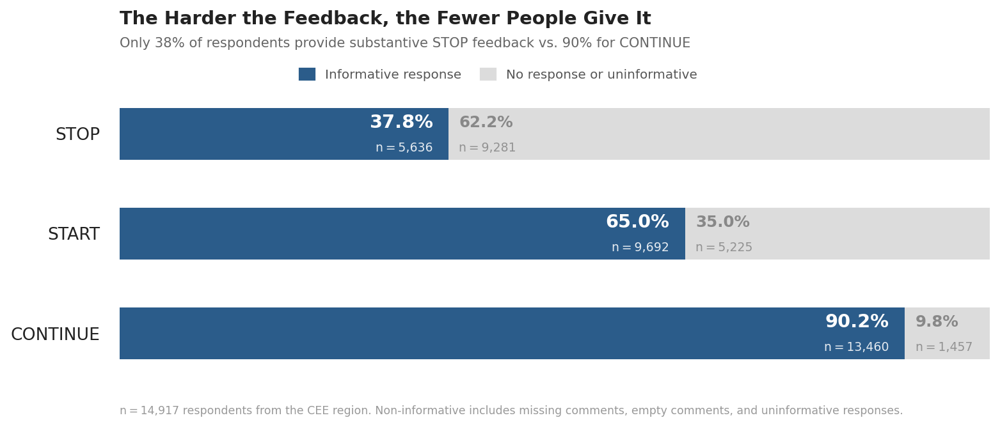
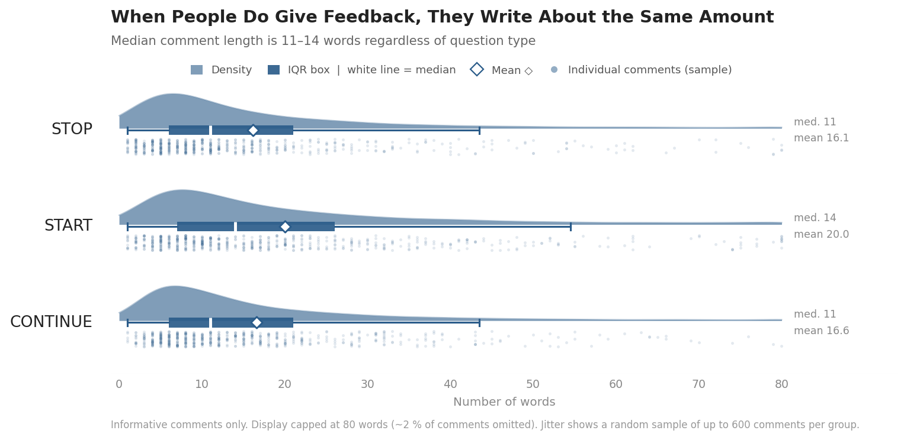

At the end of the year before last, in the context of New Year's resolutions, [I posted about finding](https://blog-about-people-analytics.netlify.app/posts/2024-12-30-new-years-resolution/){target="_blank"} that people most often search Google for ways to stop doing things, followed by how to start doing things, and least often, how to continue doing things, and also speculated about the possible reasons behind this pattern.

I was curious if we'd find a similar or different pattern in what people write to others in 360-degree feedback contexts.

I used a real-world dataset from various 360 feedback projects across several CEE countries, involving ~15K assessors, to compare how frequently they wrote informative comments in the START, STOP, and CONTINUE sections (i.e., excluding non-informative phrases such as “nothing” and “I don’t know”), as well as the length of informative comments in completed sections.

Interestingly - but perhaps not so surprisingly - the pattern I found was completely reversed from what we can see on Google Trends: people most often told others what they should keep doing (90.2%), then what they should start doing (65%), and least often what they should stop doing (37.8%).

{width=100%}

When it comes to comment length, the comments are largely similar on average; only those in the Start section are slightly longer than the other two (median of 14 vs. 11 words).

{width=100%}

I can only speculate about the reasons behind this, but my guesses would probably include social politeness and relationship preservation motivation, psychological safety concerns (even in anonymous 360 systems), cultural conditioning around strengths-based development, discomfort with direct criticism, possibly also the order effect of question presentation, and new behaviors requiring more explanation and context. 

❓What would be your guesses? And have you run a similar analysis yourself with similar/different results?

P.S. A recent critical systematic review of the performance feedback literature by [Heine et al. (2026)](https://www.researchgate.net/publication/396923591_Performance_Feedback_A_Critical_Systematic_Review){target="_blank"} suggests that this pattern may be actually quite adaptive: positive feedback appears to be more consistently beneficial overall, whereas negative feedback is more context-dependent and more likely to backfire, especially when trust, credibility, and psychological safety are low. Moreover, telling people what to start doing next may be a safer way of “fixing” behavior, as it is less likely to trigger internal resistance than telling them what not to do. So maybe the assessors know what they’re doing 😉