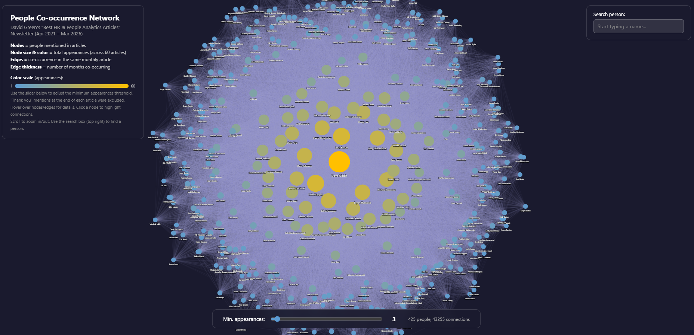

Being featured in [David Green](https://www.linkedin.com/in/davidrgreen){target="_blank"}'s "Best HR & People Analytics Articles" newsletter inspired me to put together a quick-and-dirty SNA based on the co-occurrence of people mentioned across all 60 editions, from April 2021 to March 2026.

IMO, it nicely illustrates David's ongoing and successful effort to bring together a remarkably wide and diverse pool of People Analytics professionals from around the globe - and yes, with some "heavyweights" sitting right in the middle of the network, but that's how real-world networks work, right? 😉

If you'd like to explore it yourself, [here it is](https://lstehlik2809.github.io/david-green-hr-people-network/){target="_blank"}.

{width=100%}

A few tips for navigating the network:

* Nodes = people mentioned in articles; node size & color reflect total appearances across 60 articles
* Edges = co-occurrence in the same monthly article; edge thickness = number of months co-occurring
* Use the slider to adjust the minimum appearances threshold
* Hover over nodes/edges for details; click a node to highlight its connections
* Scroll to zoom in/out; use the search box (top right) to find a specific person

P.S. You can consider this a prequel to the People Analytics Network Census (PANC), which is about to wrap up its second wave. If you haven't participated yet, sign up [here](https://lnkd.in/dSVT34sf){target="_blank"} 🙂