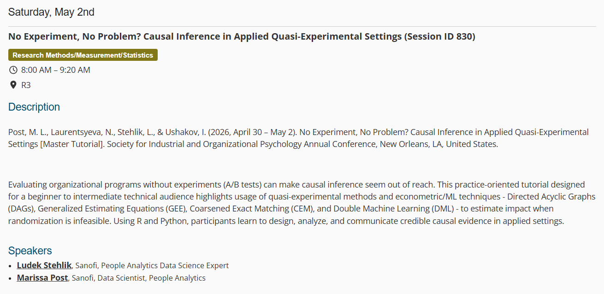

Excited to share that Marissa Post and I will be co-delivering a workshop at the [2026 SIOP Annual Conference in New Orleans](https://www.siop.org/events/the-annual-conference/program/schedule/){target="_blank"}.

{width=100%}

Most causal inference material focuses on clean examples or theory in isolation. In practice, causal analysis is a workflow - and a messy one.

Our workshop walks through a realistic end-to-end case study - evaluating a leadership development program with open enrollment, where there's no clean experiment to lean on.

We work through the full pipeline: defining the estimand, constructing and reasoning about a causal DAG, diagnosing positivity violations, choosing an adjustment strategy under real data constraints, and estimating treatment effects using IPTW, GEE, survival analysis, and Double Machine Learning, if time allows. We also cover sensitivity analysis (E-values) and how to communicate uncertain findings honestly to stakeholders.

The setting is deliberately realistic - voluntary program enrollment, no randomization, self-report bias, and unmeasured confounders you can't wish away. All hands-on in an interactive Jupyter notebook.

If you're at SIOP and interested in making causal thinking more practical in applied People Analytics settings - come say hi 🤓