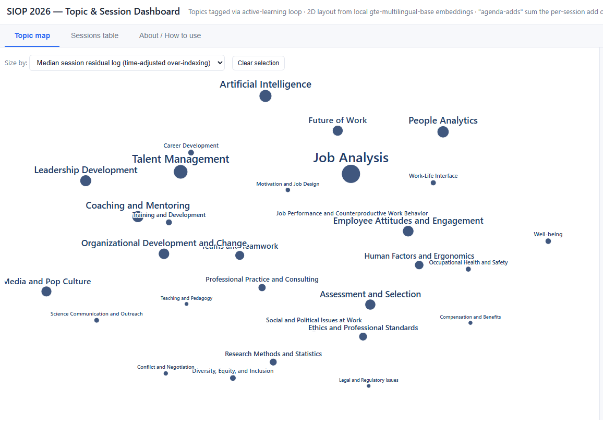

After my first SIOP conference, I found myself wondering what useful content I might have missed simply because of the sessions I chose to attend. Think of it as a retrospective “lost opportunity cost” analysis 🤓

A sidenote: this could easily turn into an unhealthy FOMO exercise, but I prefer to treat it more positively as a way to spot sessions or themes I may want to catch up on later through other channels 😉

One imperfect way to look at this is to use a kind of “wisdom of crowds”-ish signal: which sessions and topics attracted more agenda interest than we would expect, given their day and time slot?

For this, I used the number of times a session was added to personal agendas in Whova as a rough proxy for pre-attendance interest. Importantly, that is not the same as actual attendance, session quality, or scientific importance.

So what showed up?

At the topic level, the five biggest positive prediction residuals were:

* *Job Analysis*
* *Talent Management*
* *Artificial Intelligence*
* *People Analytics*
* *Coaching and Mentoring*

For me, the most relevant omission was probably Job Analysis, which I mostly missed in my own session choices. Given how much jobs are already changing because of AI, this may be one area where I should have followed the crowd a bit more.

At the session level, the five biggest positive residuals were:

* *Hot Takes, Hot Wings: A Spicy Conversation With I-O Psychology's Thought Leaders*
* *Proactive People Analytics Solutions: Addressing Tomorrow's Problems Today*
* *Future Storming Insights: Emerging Trends and the Future of I-O Psychology*
* *How to Leverage Employee Listening Data to Effectively Drive Change*
* *Binge-Worthy Leadership Development: Enhancing Learning Through Popular TV Series*

These seem to combine several strong attention drivers: the promise of learning something new in a fun and original way, the possibility of creating real-world impact, and curiosity about what the future holds - an ideal recipe for sparking people’s interest, right? 🙂 Personally, I attended the two most connected to impact, but apparently I left some fun and future-looking sessions on the table. Maybe next time?

Methodological note: Results are based on Whova data from the three main conference days. Topics were identified through an LLM-assisted active-learning loop using only session titles, and topics are not mutually exclusive. Poster sessions were excluded because they likely come from a different data-generating process compared with other session types. 

P.S. If interested, you can check out [this simple interactive dashboard](https://lstehlik2809.github.io/siop-2026-reflection/){target="_blank"}, where you can explore the topics from other perspectives and drill down to individual sessions by topic and topic combinations.

{width=100%}

