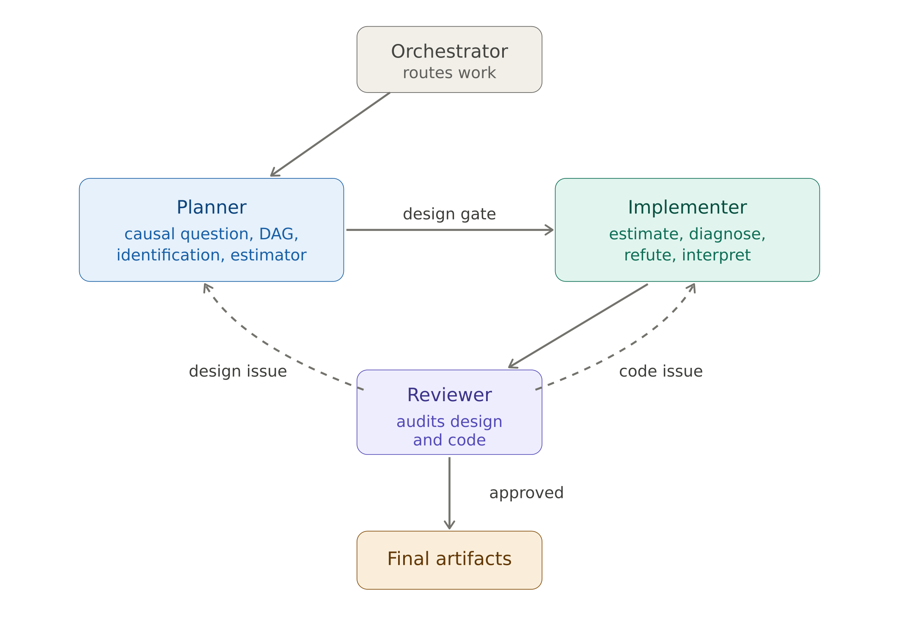

While preparing causal inference workshops for two recent conferences - SIOP 2026 and Machine Learning Prague 2026 - our team started experimenting with adding AI automation to our usual causal analysis workflow.

The motivation was practical. Causal analysis involves many decisions before any estimator is run: defining the causal question, specifying the treatment and outcome, understanding the assignment mechanism, choosing adjustment variables, drawing a DAG, checking identification, and deciding which diagnostics and robustness checks are necessary.

These steps are easy to compress or skip when working with a general-purpose AI assistant. We wanted a workflow that makes the design stage explicit, forces important decisions to be documented, and prevents the assistant from moving to implementation before the causal setup is clear.

The current version is a small, opinionated repo that wires together three layers.

### 1. A reusable causal-inference skill
The first layer is a reusable causal-inference skill: a `SKILL.md` file plus reference materials for study design, DAGs and identification, estimator choice, diagnostics, refutation and sensitivity analysis, code recipes, and reporting.

The skill encodes a 10-step workflow:

*Formulate → Design → DAG → Identify → Choose estimator → Estimate → Diagnose → Refute → Interpret → Report*

Steps 1-5 are design-focused. The agent should not write analysis code until the causal question, DAG, identification strategy, and estimator choice have been made explicit.

The workflow is adapted from the [causal inference skill by Alexandre Andorra](https://github.com/Learning-Bayesian-Statistics/baygent-skills/tree/main/causal-inference){target="_blank"} from Learning Bayesian Statistics. We adjusted it to be more broadly accessible, moving beyond a primarily Bayesian analytical framing while keeping the emphasis on causal design, identification, DAG-based reasoning, estimation strategy, diagnostics, and robustness checks. 

The skill follows the same `SKILL.md` plus `references/` structure with progressive disclosure, so the agent only loads the reference file relevant to the current step.

The repo also includes a document-generation skill, based on Anthropic’s `docx` skill, used near the end of the workflow to produce Word reports. These reports cover the causal question, assumptions, analysis plan, diagnostics, robustness checks, and interpretation.

### 2. Repo-level invariants
The second layer is an `AGENTS.md` file with rules that apply across agents. This file contains the main workflow constraints and guardrails. For example:

* if there is no DAG, the workflow stops at Step 3
* if the identification status is “not identified,” the workflow stops at Step 4
* if key diagnostics fail, the agent should not produce a final summary
* panel data should use appropriate inference defaults, such as cluster-robust standard errors where relevant
* staggered adoption designs should not be handled with a naive default specification
* causal language should be calibrated to the strength of the design
* unresolved design choices should trigger structured clarification questions before the design is locked

The goal is to make the workflow more disciplined and easier to audit. Many causal analysis problems originate before estimation: vague treatment definitions, unclear assignment mechanisms, inappropriate controls, post-treatment covariates, positivity problems, or unsupported identification claims. The invariants file is meant to catch some of these issues before they are buried in code.

### 3. Four agent roles
The third layer is a set of four agent roles with explicit handoffs.

* **Orchestrator** routes the work.
* **Planner** handles the design stage. It covers the causal question, target trial emulation where appropriate, DAG, identification, estimator choice, and design decisions. It writes a versioned plan and a `design.yaml` file containing the key answered design questions.
* **Implementer** handles estimation, diagnostics, robustness checks, interpretation, and report preparation. It should only proceed after the design has been approved.
* **Reviewer** audits both the design and the implementation. Each finding is classified as either design-level or code-level. Design-level findings are routed back to the Planner. Code-level findings are routed back to the Implementer. The Reviewer continues routing findings until the analysis is ready to finalize.

In practice, this creates an iterative workflow rather than a single long prompt. The process usually involves several rounds between the Planner, Implementer, Reviewer, and the human analyst.

{width=100%}

### Project structure
The repo also enforces a few project-hygiene rules.

* Raw data is treated as immutable.
* `project.yaml` is the main source of truth for what is already known about the project: treatment, assignment mechanism, outcomes, covariates, measurement timing, and file paths.
* Every output artifact records the plan version it was produced against.

This makes it easier to see which design decisions were in place when a particular result, diagnostic, or report was generated.

### Platform support
This template is implemented for GitHub Copilot custom agents. The workflow itself is platform-neutral: adapt `AGENTS.md`, `.github/agents/*.agent.md`, and `causal-inference` to your preferred agentic coding tool’s instruction format. Most modern coding agents can do this translation in a few minutes.

You can find the repo [here](https://github.com/lstehlik2809/causal_inference_agentic_workflow){target="_blank"}.

### How to use it
A typical workflow starts by forking the repo. Then you fill in `project.yaml` with the information you already know about your project:

* the intervention or treatment
* who was treated
* the outcome
* outcome measurement timing
* pre-treatment covariates
* assignment mechanism, if known
* paths to the raw data

Then you place the raw data files into `raw/`.

After that, open your AI assistant of choice and ask the Planner to read `project.yaml` and prepare a causal estimation plan.

The Planner performs structural EDA on the raw data, emulates a target trial where appropriate, draws a DAG, asks design-critical clarification questions, and writes the plan to:

`docs/plans/<slug>.md`

Once the design questions are answered and the identification block is approved, the work moves to the Implementer.

The Implementer writes and runs the analysis code, produces diagnostics and robustness checks, and prepares outputs.

The Reviewer then audits the design and implementation. If the analysis is ready, it returns a terminal approval. If not, it routes findings back to the Planner or Implementer, depending on whether the problem is design-level or code-level.

### Current status
So far, we have tried the workflow on two projects. That is still a small sample, but the initial experience has been encouraging.

The workflow feels fairly natural because it matches the way causal analysis usually unfolds: not as one clean linear sequence, but as repeated movement between design clarification, implementation, diagnostics, review, and revision.

A typical run has taken around 10-15 iterations across the Planner, Implementer, Reviewer, and the human analyst.

The most useful aspect so far has been the enforced separation between design and implementation. The agent is less likely to rush into estimation, and the human analyst gets clearer artifacts to review: a design plan, a DAG, an identification block, diagnostics, robustness checks, and a final report.

### Limitations
This is not meant to replace domain knowledge or causal judgment. The workflow can help document assumptions, enforce process constraints, and surface missing design decisions. It cannot determine whether the assumptions are substantively correct. That still requires human expertise and, usually, discussion with people who understand the domain, intervention, data-generating process, and measurement context.

The workflow is also still early. We need to test it across more designs, data structures, and failure cases. The areas where I expect problems to show up first are:

* complex longitudinal treatments
* interference and spillovers
* weak or ambiguous assignment mechanisms
* high-dimensional adjustment problems
* missing data and censoring
* transportability and external validity
* designs where the estimand itself is contested

### Feedback welcome
The repo ships with dummy data from a manager leadership development program evaluation - the same dataset we used at the workshops. It's a realistic observational setup (voluntary participation, uneven program uptake across departments, baseline and follow-up survey outcomes, retention flags at 3/6/9/12 months), so you can run the workflow end-to-end without your own project.

Give it a try and let me know how it works for you. I would especially appreciate feedback on:

* where the workflow is too rigid
* where the guardrails are not strict enough
* which causal designs it handles poorly
* which parts of the handoff between agents are unclear
* what additional diagnostics, templates, or reference materials would be useful

I would also be very interested to see related efforts. If you are building agentic workflows for causal inference, statistical analysis, scientific workflows, or research automation more broadly, please share what you have tried and what has or has not worked.
