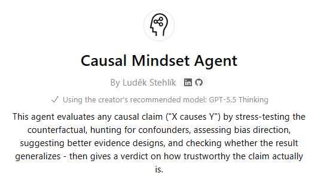
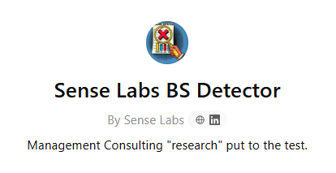

It's often said that critical thinking is one of the human skills that will stay important even in a world increasingly shaped by AI.

The catch: the volume of information hitting our senses keeps growing, and a growing share of it is now AI-generated. Applying critical thinking at that scale may realistically require some help from AI itself. Otherwise we lose the fight against [Brandolini's Law](https://en.wikipedia.org/wiki/Brandolini%27s_law){target="_blank"}, the bullshit asymmetry principle: "*the amount of energy needed to refute bullshit is an order of magnitude bigger than that needed to produce it.*"

A small example. I built a [bot around the five-step causal reasoning framework](https://chatgpt.com/g/g-69afe08219508191b0806e31c5f0d0af-causal-mindset-agent){target="_blank"} from [Dr. Quentin Gallea's "*The Causal Mindset Handbook*"](https://thecausalmindset.com/book){target="_blank"} and ran it against a recent [whitepaper from an HR-tech vendor in the employee-listening space](https://offer.welliba.com/hubfs/Latest%20Files%20for%20Linking/Welliba%20S%26P%20500%20Hidden%20Economics%20Whitepaper%20v_01.0.pdf?hsLang=en){target="_blank"}.

{width=65%}

The paper presents this as "*the hidden economic value of employee experience*" and pinpoints "*where investment in people delivers the greatest return.*" Specifically: the top 100 S&P 500 companies on employee experience (EX) outperformed the rest by 5% in total shareholder return over five years, based on AI analysis of 25 million data points pulled from more than 150,000 websites.

It never uses the word "causes," but the whole document, from the title ("*Hidden Economics*") to the recommendation to invest in the "*low-hanging levers*" for "*the fastest route*" to performance gains, is built to land as a causal claim. That is the claim worth testing.

The bot, in my view, surfaced several methodological concerns with real precision:️

* This is a pure cross-sectional comparison. It has none of the elements that move a claim up the causal ladder. The proxy counterfactual is thin: a snapshot of the top 100 EX firms vs. the rest, with no controls for industry, size, or profitability. That is a long way from a parallel-world comparison. The Magnificent 7 and other AI-related stocks were also excluded "to minimise distortion from extreme growth dynamics," which is outcome-correlated: unless the exclusion rule was pre-specified, it could materially affect the reported 5% gap. The paper's own chart shows the 5% gap opening only in 2024-2025, not compounding across the full five-year window.
* The confounder picture is one-sided. Reverse causation is the heaviest one: profitable, rising companies pay more, hire selectively, and have employees sitting on appreciating stock comp, all of which produces better public sentiment on the very platforms feeding the EX score. Industry mix (IT, Banking, Life Sciences dominate the Top 25) and S&P 500 survivorship push the same way. The net direction of bias is amplification. The true effect, if any, is likely materially smaller than 5%.
* The "drivers" claim has inverted logic. Colleagues and direct managers are flagged as dominant positive drivers because they score high in 66% and 62% of firms. But factors that score universally high have low variance, and therefore low explanatory power for differences in outcomes. The factors that actually vary across companies are where the causal signal would live: communication, rewards, working conditions.
* Getting closer to a parallel-world situation would require a lagged design (EX measured in year T, returns tracked in T+1 to T+5), within-firm fixed effects, industry-size-profitability matching, or natural experiments such as CEO transitions or RTO mandates that shift EX exogenously. The paper offers none of these.

None of this means employee experience doesn't matter. It probably does. But the specific evidence in this paper is correlational, framed as if it were causal.

What I found more useful than the critique itself is the workflow: a structured causal-reasoning framework that a model can apply in a minute or two. That is the kind of capability that will change how many of us read research, marketing claims, and internal dashboards.

Happy to be pushed back on any of this - vendors with skin in the game often see things I don't.

Curious what other frameworks you’ve made actionable in a similar way and found useful. Feel free to share links, if available.

----

**Update**: One of the commenters on the LinkedIn version of this post pointed me to the “*BS Detector*” created by Paul Sweeney, author of the excellent ["*Magnetic Nonsense: A Short History of Bullshit at Work and How to Make It Go Away*"](https://www.amazon.co.uk/MAGNETIC-NONSENSE-SHORT-HISTORY-BULLSHIT/dp/1068531037){target="_blank"}. You can access the tool [here](https://senselabs.co/bs-detector){target="_blank"} or find it among the publicly available GPTs on OpenAI’s platform under the name "*Sense Lab BS Detector*". Give it a try. I tested it on several papers, and it’s brutally honest and direct, just like its author 🤓

{width=65%}

P.S. If you don’t follow Paul, you should. His LinkedIn posts may challenge some of your favorite and deeply entrenched beliefs about work-related topics. He regularly brings a much-needed dose of skepticism to how we think about what we do in the HRM space.