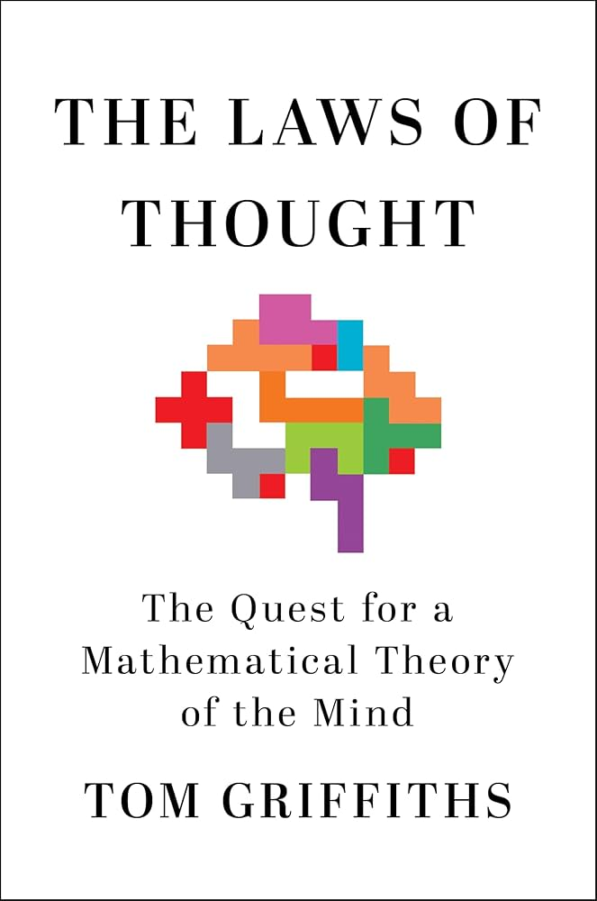
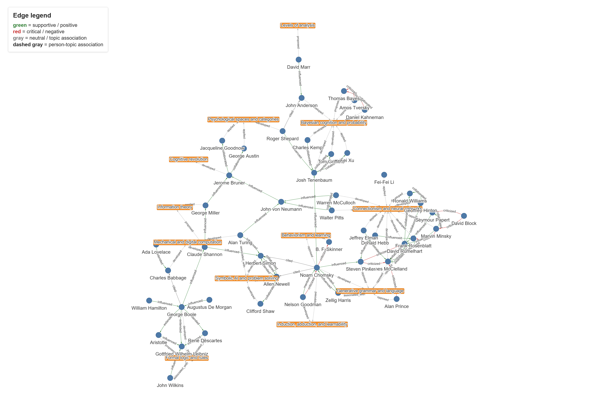

I just finished reading Tom Griffiths’ amazing book, [*The Laws of Thought: The Quest for a Mathematical Theory of the Mind*](https://www.amazon.com/Laws-Thought-Quest-Mathematical-Theory/dp/1250358353){target="_blank"}, over the weekend.

{width=35%}

In a compact and very accessible way, it covers roughly 300 years of human efforts to understand how and why the mind does what it does, using various mathematical tools and frameworks.

Among other things, the book shows how attempts to understand human cognition and attempts to build artificial minds have deeply shaped each other. It also provides deeper context for understanding current LLMs - their strengths as well as their limitations - from the perspective of probability theory at the computational level of analysis.

**All in all, highly recommended!**

P.S. The chart bellow represents a kind of knowledge graph generated from the book. It shows two layers at once: key figures, such as Chomsky, Boole, Turing, Skinner, Rumelhart, McClelland, Marr, and Tenenbaum; and major topics that organize the book, such as formal logic, symbolic AI, generative grammar, connectionism, and Bayesian cognition. Green edges mark supportive relationships, such as influence or collaboration; red edges mark critique; and gray dashed edges connect people to topics. The graph includes 48 people, 12 topics, 64 aggregated figure-to-figure edges, and 50 person-topic edges. You may need to click on the image and zoom in to see all the details 🕵️‍♂️

  

Methodological note on the knowledge graph: The relationships were not inferred from simple co-occurrence. Every figure-to-figure edge had to be explicitly asserted in the text and backed by a verbatim quote. The pipeline extracted and cleaned the PDF, split it into chapters, induced a fixed 12-topic taxonomy, built an entity catalog, used an LLM to identify and classify evidence-backed relationships, and then ran code to verify that every evidence quote appeared in the source chapter. Mechanical steps were handled by code, semantic steps by the LLM, and evidence quotes were checked by deterministic code.