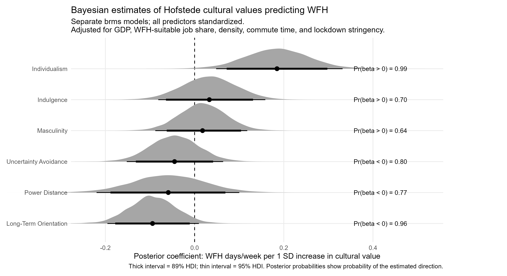
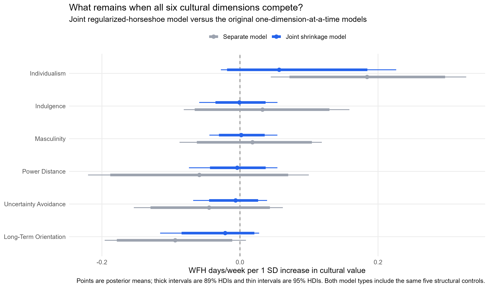
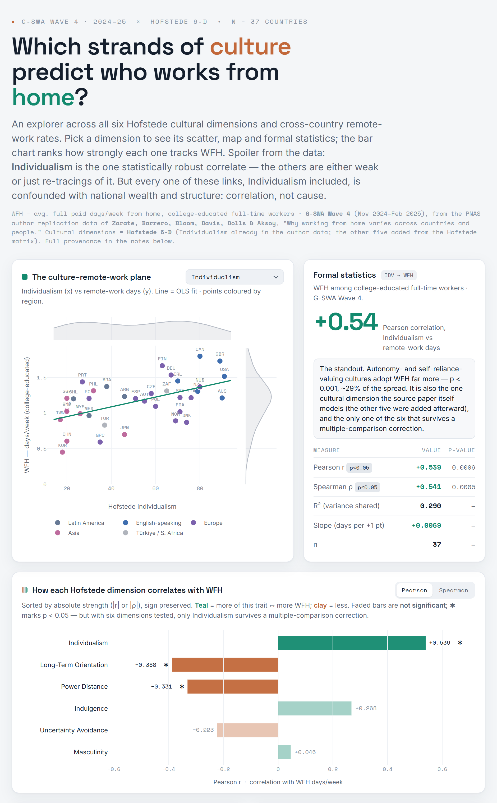

Recently, I listened to a podcast episode featuring Nicholas Bloom, where he mentioned an interesting finding from his recent research with colleagues ([Zarate et al., 2025](https://www.pnas.org/doi/10.1073/pnas.2529036122){target="_blank"}):

Countries scoring higher on individualism - as conceptualized in [Hofstede’s cultural-dimensions model](https://geerthofstede.com/culture-geert-hofstede-gert-jan-hofstede/6d-model-of-national-culture/){target="_blank"} - tend to have more work-from-home days per week. This association remains in a model that includes GDP per capita, the share of jobs suitable for WFH, population density, commuting time, and pandemic lockdown stringency.

Intuitively, this makes sense: individualistic cultures may place greater value on autonomy and personal control, while their organizations may be more comfortable evaluating employees by outcomes rather than physical presence. Still, this intuitive explanation deserves a generous grain of salt. Even with these controls, many potential confounding paths remain.

This sparked my curiosity about Hofstede’s remaining cultural dimensions. Several of them could plausibly matter for WFH decisions. For example:️

* Power distance may shape how comfortable managers are with granting autonomy.️
* Uncertainty avoidance may affect tolerance for the less visible and less standardized nature of remote work.️
* Long-term orientation may influence how organizations balance immediate flexibility against long-term coordination, learning, and social cohesion.

However, these other dimensions were not examined in the paper. Fortunately, the authors shared their data. It was therefore fairly straightforward to enrich their dataset with the remaining Hofstede dimensions and run an analogous analysis for each one.

The results? The chart below presents posterior estimates from six separate Bayesian Gaussian regressions. Individualism emerged as the clearest positive correlate: 99.3% of posterior draws were above zero. Long-term orientation showed the most suggestive negative association, with 96.4% of draws below zero. Power distance and uncertainty avoidance also leaned negative, but with considerably more uncertainty. The estimates for masculinity and indulgence were weakly positive and highly uncertain.

{width=100%}

To get a clearer view of whether WFH frequency is related to specific Hofstede dimensions, we need to account for the fact that the six cultural scores are correlated. In separate models, the coefficient for one dimension may partly capture variation that it shares with other dimensions. For example, an individualism coefficient may reflect not only individualism itself, but also the fact that more individualistic countries often differ systematically on power distance, uncertainty avoidance, or long-term orientation.

A complementary approach is therefore to include all six Hofstede dimensions in the same regression. This changes the interpretation of the cultural coefficients: each estimate now reflects the association between WFH and the part of that dimension that is not shared with the other five dimensions, while also conditioning on the available country-level covariates.

However, with only 37 countries and several correlated cultural predictors, the joint model can become unstable and sensitive to model specification. To make this comparison more conservative, I used a regularized horseshoe prior on the six cultural coefficients. This prior shrinks the cultural block toward zero overall, while still allowing individual dimensions to retain larger estimates if the data contain a sufficiently distinct signal.

The chart below compares the estimates from the separate models with those from the joint shrinkage model. Individualism remains the largest cultural estimate in the joint model, but the evidence is much weaker than in the separate model. Long-term orientation retains the second-largest directional signal, although it also shrinks substantially. The remaining dimensions are estimated much closer to zero, suggesting that their apparent associations in the separate models may have partly reflected variation shared with other cultural dimensions.

{width=100%}

Do any of these findings surprise you - or do they mostly support your existing intuitions?

⚠️ Note: Interesting as these patterns may be, they should be interpreted cautiously. The Hofstede dimensions are intercorrelated, hidden confounders may remain, the sample covers only 37 countries, and WFH was measured specifically among full-time, college-educated workers.

P.S. If interested in exploring the data visually, visit [this dashboard](https://lstehlik2809.github.io/hofstede-wfh/){target="_blank"}. 

{width=100%}

