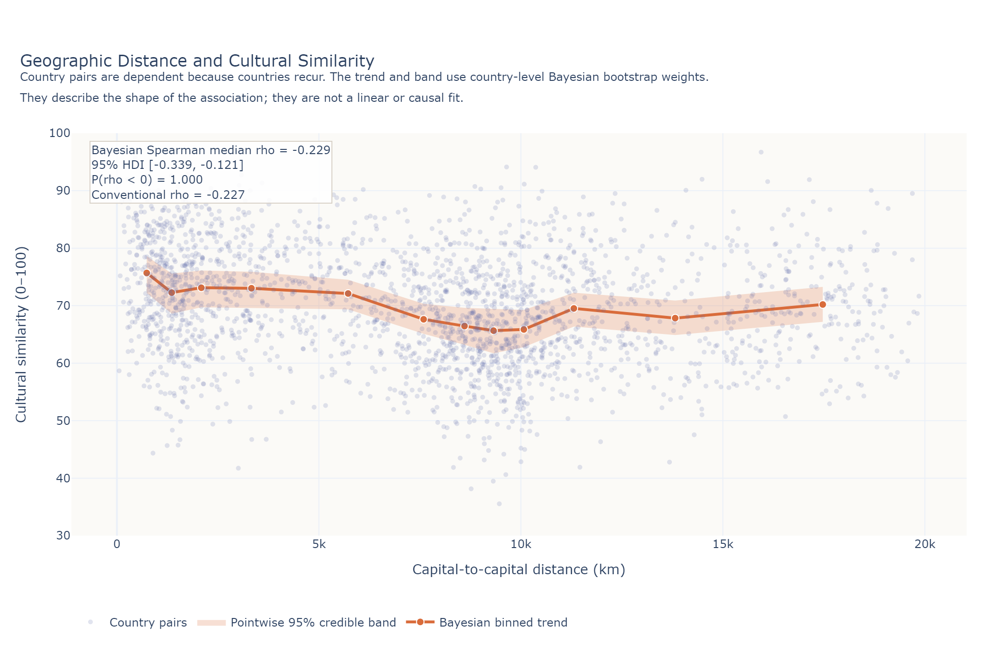

My recent encounter with [Hofstede’s cultural dimensions model](https://geerthofstede.com/culture-geert-hofstede-gert-jan-hofstede/6d-model-of-national-culture/){target="_blank"} in the context of the [work-from-home topic](https://blog-about-people-analytics.netlify.app/posts/2026-06-18-hofstede-wfh/){target="_blank"} reminded me of a nerdy and probably not very practical idea I had some time ago.

I wanted an app that could find cultural doppelgangers of countries I’d like to visit - but closer to home. The idea was to reduce travel distance, potentially save money, and perhaps make the trip a little friendlier to the environment.

And because these days what separates you from materializing even the craziest app idea you have is just your willingness to sacrifice one hour of Netflix, I built it 🤓 Check out the resulting app [here](https://cultural-traveler.streamlit.app/){target="_blank"}.

It answers three questions:️

* **Cultural twin**: Which countries near my home culturally resemble a more distant country I’d like to visit?️
* **Maximum otherness**: Within a chosen radius, which country is culturally least similar to my home?
* **Home away from home**: If I want to travel abroad without encountering too many cultural surprises - yes, even such travelers exist 😲 - which nearby countries are the best candidates?

{width=100%}

The search radius is based on distances between capital cities. You can also decide which cultural dimensions matter more to you. The app optionally considers differences in local price levels using World Bank PPP-based household-consumption data, but this is only a rough affordability indicator: it does not include flights, accommodation choices, seasonality, or your talent for finding suspiciously cheap restaurants 😉

Ideally, the app would also consider flight prices, but I’m not willing to sacrifice another one or two hours of Netflix watching 😁

Give it a try and let me know whether it sparks some inspiration for your upcoming summer holiday season.

P.S. Hofstede’s country scores are broad national averages. They capture only a small part of what shapes a travel experience and say nothing about every individual, city, or neighborhood, so please treat the results just as a playful source of inspiration. I don’t want to receive complaint letters later saying that I ruined someone’s vacation 😁

----

**Update**: One of the commenters on the LinkedIn version of this post asked an interesting question relevant to the first and third use cases covered by the app: "*how often are 'similar countries' not neighboring countries?*" That question sent me back to the data to check. What were the results? Across all 69 countries, 78% had a closest cultural twin that wasn’t a neighbor, and even among countries with at least one land neighbor, the figure was 73%. However, that doesn’t mean geography and culture are unrelated, just less strongly related than one might expect - the rank correlation was fairly weak (*ρ* = -0.23), but robustly negative (95% HDI: -0.34 to -0.12), even after accounting for the non-independence of country pairs.

{width=100%}

