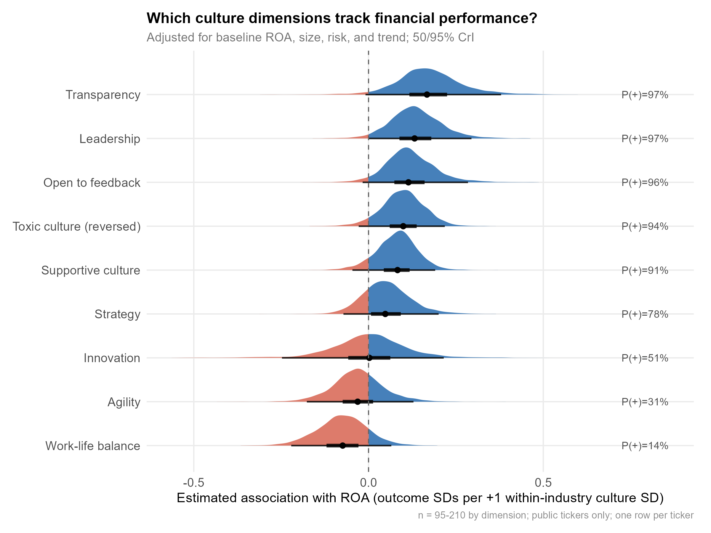
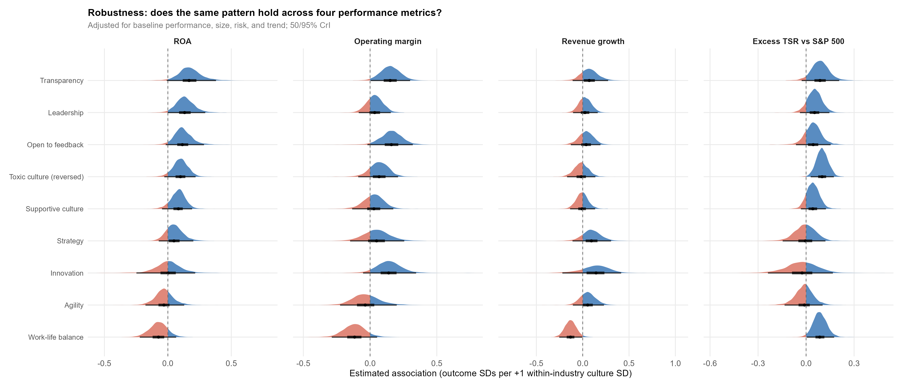
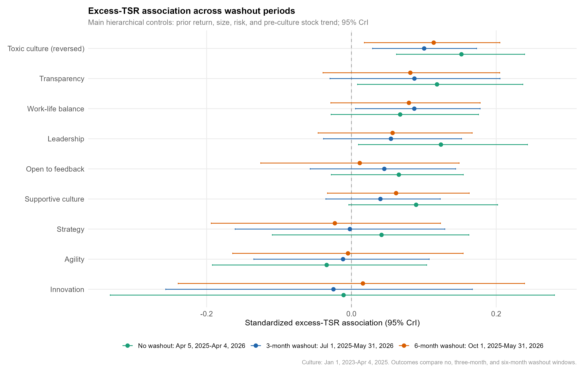

Some time ago, in response to my [post about hidden trade-offs in corporate culture](https://blog-about-people-analytics.netlify.app/posts/2025-09-17-corporate-culture-trade-offs/){target="_blank"}, Nick Hudgell, suggested examining how different aspects of culture are associated with subsequent financial performance.

It took me several months to return to the idea - but I finally did 🤓

### THE DATA
One merged company-level dataset, one row per public company. The nine culture dimensions - transparency, leadership, openness to feedback, supportive culture, low toxicity, strategy, innovation, agility, work-life balance - come from CultureX, which scored anonymous Glassdoor reviews posted between January 1, 2023 and April 4, 2025 across companies in different industries.

Each company is paired with four forward outcomes: return on assets, operating margin, revenue growth, and excess total shareholder return versus the S&P 500. After keeping public listings and complete cases, each model runs on roughly 95 to 210 firms.

### THE TIMING
The timing helps reduce one concern: the culture scores are measured before the outcome window. The review period ends in April 2025, and the forward stock-return window runs through April 2026. The pre-culture financial controls draw on 2020 to 2022 history. That does not establish causality, but it makes the analysis closer to a forward-looking association than a same-period correlation.

### THE METHOD
A separate Bayesian hierarchical model for each culture-and-outcome pair, with industry-level pooling and Student-t residuals to reduce sensitivity to outliers. Each one standardizes culture within industry and adjusts for prior performance, firm size, stock volatility, and pre-existing trend.

### THE RESULTS: FORWARD ROA, THE HEADLINE OUTCOME

* A “relational” cluster sits on the positive side. Under this model, the posterior probability that the coefficient is positive is 97% for transparency, 97% for leadership, 96% for openness to feedback, 94% for low toxicity, and 91% for supportive culture.
* The “operational” dimensions are less informative. Strategy lands at 78%, innovation at 51%, and agility at 31%, all with wide two-sided uncertainty.
* Work-life balance breaks from the pack. Under this model, it is only 14% likely to be positive for ROA. I would not read this necessarily as evidence that work-life balance hurts profitability; it may be picking up business model, growth stage, labor intensity, or review-selection differences.

{width=100%}

### ACROSS THE FOUR OUTCOMES
Re-running every dimension against all four metrics shows where the signal concentrates. The relational cluster is strongest for the two profitability outcomes, ROA and operating margin. Revenue growth is the weakest outcome: effects sit closer to zero and the relational ordering no longer holds. Excess TSR partly diverges: low toxicity, transparency, and leadership stay positive, while work-life balance flips from negative on profitability to positive on market return.

{width=100%}

### TWO THINGS I WOULD PUT NEXT TO ANY HEADLINE
First, the effects are modest: about 0.1 to 0.2 outcome standard deviations per one within-industry standard deviation of culture. In practical terms that is small, and better communicated as a tendency than as a promised return.

Second, the dimensions are heavily correlated. When all nine compete in a single regularized horseshoe model on the 95-firm complete-case sample, transparency remains the most consistently positive dimension in the joint model: 87% probable positive. The rest collapse toward zero, although the evidence is limited here by the small complete-case sample. So I would not read these as nine independent culture effects. The cleaner reading is one correlated relational-culture bundle, with transparency as its most distinct carrier.

### WHERE THE PATTERN HOLDS
The ROA ordering is reasonably stable across several robustness checks. It holds when I swap headcount for assets as the size control, when baseline performance is a multi-year average instead of the latest level, and when industry is modeled with fixed effects, which sharpens the leading cluster to between 98% and 100%. The market-return signal also survives no-washout, three-month, and six-month return windows, so the result does not appear to be driven solely by the exact return-window choice.

{width=100%}

### THE CAVEAT
This is observational. These are adjusted associations, not causal effects. The strongest alternative explanation is that well-managed firms both earn better employee language around transparency and leadership and later deliver better profitability. The model adjusts for observable history, but it cannot fully separate culture from broader management quality.

The culture measure is also indirect: built from employees who chose to post reviews, it may track morale, employer brand, or recent business momentum as much as culture itself.

And the sample is small and public-only: 95 to 210 firms per model, and just 95 across six industries when all nine dimensions compete jointly. That is a thin base from which to generalize to private firms, other regions, or every industry.

So I would keep the claim narrow: a relational-culture bundle, transparency above all, is modestly associated with better forward profitability after adjusting for major observable differences. It does not say that raising transparency will raise ROA 😔

The claim is narrow but, imo, still useful: relational culture, especially transparency, is a modest forward signal of profitability. Not a magic lever. Not causal proof. More like a corporate smoke detector - not the fire itself, but a signal worth investigating before ignoring 🤔

P.S. If you would like to replicate or extend the analysis, you can find the dataset on [my GitHub page](https://github.com/lstehlik2809/company-culture-financial-performance-data){target="_blank"}.
