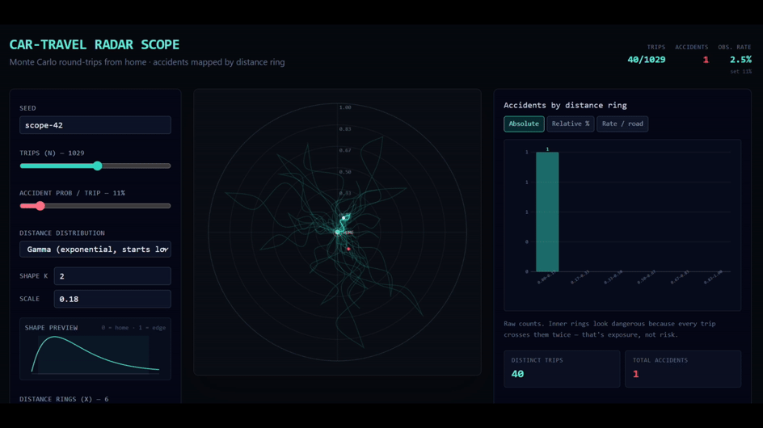

Recently, we had a family discussion about why so many car accidents happen relatively close to home. It nicely illustrated one of the cognitive blind spots all of us run into from time to time.

Most explanations offered in the discussion were driver-centered: people are tired after a long trip, they relax too early because they are almost home, familiar roads make them overconfident, or they stop paying close attention because the surroundings feel routine.

These explanations may be true in some cases. But they are not the first explanation we should reach for. The simpler baseline is exposure. Many trips start or end at home. Many everyday trips are also short: shopping, school, work, the gym, visiting friends, errands, appointments. So a large amount of ordinary driving happens within a relatively small radius of home. That alone can produce the pattern.

Suppose accident risk per kilometre were constant everywhere. That is not realistic, but it is a useful null model. Under that assumption, accidents would still cluster near home simply because driving exposure clusters near home.

And this clustering does not actually depend on most trips being short. Every trip that starts from home passes through the roads near home; only some trips ever reach the roads far away. So whatever the mix of trip lengths happens to be, the area near home is the stretch of road that the most journeys have in common, and therefore the stretch that carries the most exposure. The "short trips" observation reinforces this, but it is not what drives it.

So the raw fact that many accidents happen close to home does not, by itself, show that people drive worse close to home. To make that claim, we would need a denominator. Not just where accidents happen, but how much driving happens at each distance from home: kilometres driven, time spent driving, number of trips, road types, intersections, speed, traffic density, time of day, and so on.

There are also different kinds of accidents. Minor crashes may be more common on local roads because of intersections, parking, pedestrians, cyclists, and frequent turning. Severe or fatal crashes may follow a different pattern because speed matters so much. So even the word "accident" needs some care.

This does not rule out psychological factors. Fatigue, familiarity, distraction, and "almost home" effects may all matter. But they should explain whatever remains after exposure and road environment have been accounted for. The mistake is to see a cluster of accidents near home and immediately explain it by driver psychology. The more basic possibility is that people crash near home because that is where they drive a lot.

To be clear, none of this is a deep or original result. For anyone comfortable with base rates and denominators, it is almost too obvious to state. What interested me was the reverse: how naturally a group of thoughtful people reached past the plain structural explanation and went straight for a psychological one.

Being a psychologist by training, this reminded me of a mix between the fundamental attribution error and base-rate neglect. The attribution-error part is the instinct to explain the pattern through the driver's mental state: fatigue, overconfidence, relaxation, distraction. The base-rate-neglect part is forgetting the denominator: how much driving actually happens at each distance from home. And it gets forgotten for a specific reason - exposure is a "merely statistical" base rate with no story attached, so it quietly loses out to the vivid causal one about the tired, overconfident driver. [Kahneman & Tversky](https://www.cambridge.org/core/books/abs/judgment-under-uncertainty/causal-schemas-in-judgments-under-uncertainty/2AF53FA85B49717E1B4C23598B1EB5BC){target="_blank"} 👋

P.S. I made [a simple tool](https://lstehlik2809.github.io/Car-Travel-Simulator/){target="_blank"} to play with this idea. It lets you simulate a "null hypothesis world" where accident risk per unit of driving is constant, while trip lengths follow different distributions. A gamma distribution is a reasonable starting point for everyday driving, because most trips are short and a smaller number are much longer, but you can swap in others. The point is not that the null model is true. It obviously leaves out many real-world factors. And the concentration near home is not an artefact of any one distribution: it shows up whatever trip-length distribution you choose. That is the whole point. Even this stripped-down model already produces accident concentration near home. You can try it [here](https://lstehlik2809.github.io/Car-Travel-Simulator/){target="_blank"}.

{width=100%}

