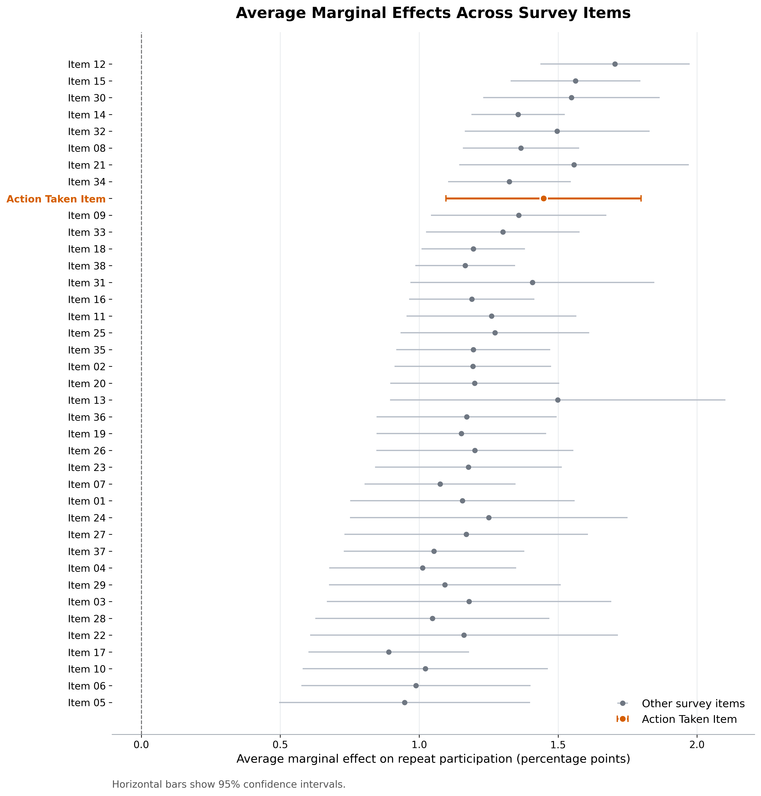
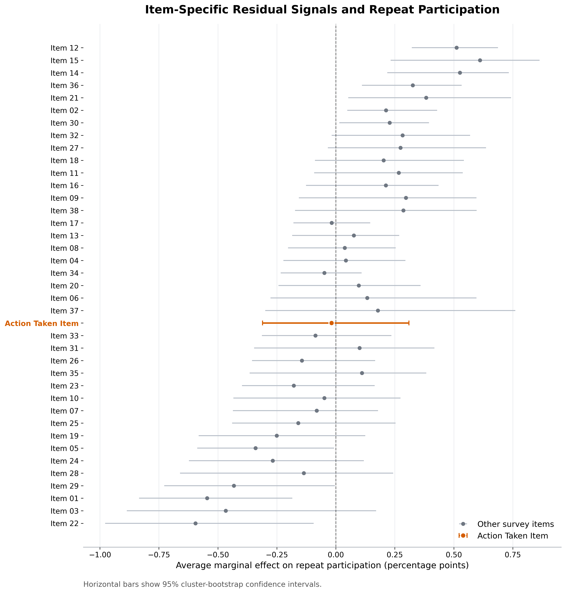

If there is one piece of widely accepted wisdom in the employee listening space, it is this: *organizations need to respond visibly and credibly to employee input, or employees will eventually stop giving it*.

That claim is repeated so often that it almost reads as self-evident. Still, I wanted to see how far it would hold up against real data.

One imperfect, but still directionally informative, way to examine this is to ask whether employees’ prior-year survey responses predict participation in the following year’s engagement survey among continuing employees who had responded previously.

I approached that question in two steps.

In the primary analysis, I used a raw prior-year survey item reflecting employees’ sense that their input had led to some visible organizational response, together with common demographic and organizational covariates, to predict next-year survey participation. This is the more substantively direct test of the practical wisdom itself: whether employees who believed their input had gone somewhere were more likely to show up again the following year.

In the secondary analysis, I took a narrower decomposition approach. For each survey item, I residualized it against a leave-one-item-out one-factor model estimated from the other survey items, using the complete-case subset required for that factor step and an organizational-cluster bootstrap to reflect uncertainty from both parts of the residualization-and-modeling pipeline. In practical terms, the secondary predictor captures the item-specific residual signal: whether an employee scored that item higher or lower than would be expected from their broader response pattern across the rest of the survey. That second specification is not a stronger causal design; it is a more specific shared-versus-residual signal test.

The contrast between the two analyses is where things become interesting.

In the primary model, the focal responsiveness item is clearly positively associated with next-year participation. Employees who scored higher on that item were more likely to respond again the following year, even after adjustment for standard demographic and organizational covariates. The association was statistically detectable but modest in size, so I would read it as evidence of a repeat-participation pattern rather than a large practical shift (one possible positive interpretation being that lower perceived responsiveness does not appear to translate into broad withdrawal from the survey as a channel for voice). At a broad level, the data are therefore consistent with the conventional wisdom.

{width=100%}

*Fig. 1: Average marginal effects from the primary model predicting next-year survey participation from prior-year survey items. Items are anonymized for public sharing; Action Taken Item is the focal perceived-responsiveness item. Horizontal bars show 95% confidence intervals.*

At the same time, that item was not the strongest item-level predictor in the raw analysis. Several other item scales measuring specific aspects of the employee experience appeared more strongly linked to repeat participation. That matters, because it suggests that future participation is not most tightly linked to a single responsiveness signal in isolation. It may be more strongly tied to a wider set of experiences that collectively shape whether employees remain willing to re-engage.

And the secondary model sharpens that point further.

Once the shared general engagement factor is removed, the focal responsiveness item no longer stands out as a distinct residual predictor. Its residual association is essentially null. By contrast, some other item-specific residual signals continued to show clearer associations with repeat participation.

{width=100%}

*Fig. 2: Average marginal effects from the secondary residual-signal model, where each item is adjusted for the broader survey-response pattern using a leave-one-item-out factor approach. Items use the same anonymized labels as in the primary chart; Action Taken Item is the focal perceived-responsiveness item. Horizontal bars show 95% cluster-bootstrap confidence intervals.*

That difference in findings changes the interpretation. If we stop at the primary model, the story is straightforward: employees who perceive some visible response to their input are more likely to participate again the next year. But once we compare the primary and secondary analyses, a more nuanced picture emerges. The predictive power of that item appears to be carried to a meaningful degree by the broader engagement climate with which it co-moves, rather than by a clearly distinct item-specific residual signal. In other words, perceived responsiveness still matters descriptively, but it appears less distinctive as a standalone predictive signal once broader employee experience is accounted for.

That, to me, is the deeper insight. The practical takeaway is not that visible response is unimportant. It is that organizations may overstate its uniqueness. If the goal is to sustain future participation, the stronger predictive signals may sit less in any single “you said, we did” item and more in the broader relational and organizational environment.

A final caveat is important. Neither analysis is causal. These are observational, associational models of repeat participation among continuing employees, based on a single year-over-year transition rather than a longer longitudinal window. They are not estimates of whether actual organizational responsiveness causes future survey participation. 

Still, even with these limitations, I think the comparison is useful. The primary analysis captures the total signal attached to perceived responsiveness. The secondary analysis asks whether that signal remains distinct after removing the dominant common engagement pattern reflected in the rest of the survey. Taken together, they suggest a more disciplined version of the standard wisdom: responsiveness likely matters, but much of what that item predicts may actually reflect the wider organizational context in which employees experience the survey process itself.

For many people working in employee listening, this may not be so surprising. But it's still useful to see the pattern show up in the data 😉

Curious if anyone has done a similar exercise, and with what results.
