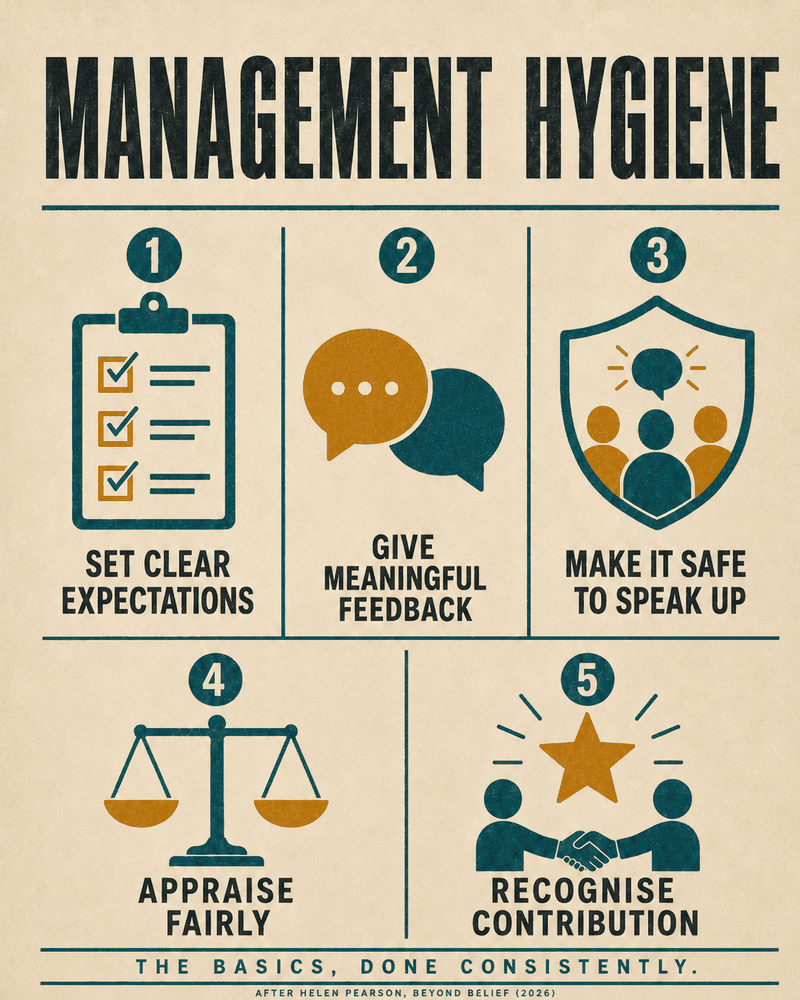

Just finished Helen Pearson’s [*Beyond Belief*](https://helenpearson.info/book/what-to-believe/){target="_blank"} (btw, highly recommended) - a book about the evidence revolution and how we discover what actually works across domains ranging from medicine and education to business, government, conservation, and parenting.

While the book contains many fascinating and relatively little-known gems - for example, did you know that [*Scared Straight* programs](https://methods.cochrane.org/equity/scared-straight){target="_blank"}, intended to deter at-risk young people by exposing them to prison life, were shown across nine randomized trials to increase rather than reduce subsequent offending? - I want to highlight here just the following two points from the chapter on evidence-based management, the area most directly relevant to People Analytics.

The first point is a reminder that the latest trends and shiny new ideas in the HRM space are often not worth our attention. Instead, we should focus on basic, simple, and, yes, relatively boring principles that are nevertheless supported by sufficient evidence. Pearson captures this nicely by quoting Eric Barends, a leading advocate of evidence-based management:

“*Barends says the best way to improve the performance and wellbeing of employees is usually to do basic things that evidence supports—the management equivalent of washing your hands or getting enough sleep.*

*Employees need to know what is expected of them in their role and have clear goals. They should be given meaningful feedback and feel psychologically safe when raising ideas and concerns. Managers should be able to fairly and accurately determine an employee’s performance in appraisals. Staff should be recognised for the contributions they make. [...]*

*These are all fairly obvious and, in most cases, says Barends, they are good enough. The biggest gains in management, he argues, are to be found in following basic evidence-backed principles rather than the latest trend.*”

{width=50%}

*A graphical illustration of the point described above - not from the book, but AI-generated.* 

The second point is a recommendation to use a simple set of questions to make better-informed decisions, thereby increasing the likelihood of a favorable outcome. Pearson cites in this context Denise Rousseau, an organizational psychologist and pioneer of evidence-based management, who suggests that, “*when facing a decision, [take] a few minutes to ask these questions: What’s the problem I’m trying to solve? What’s the evidence for the problem? What solutions are appropriate? What’s the evidence for the solutions? [...]* 

*For instance, a CEO might require that everyone attend the office five days a week based on the assumption that face-to-face interactions lead to more innovation. The evidence-based manager first unpacks the assumptions underlying this decision: the company is insufficiently innovative; this is damaging business objectives; face-to-face interactions will boost innovation and are more effective than other solutions, such as virtual meetings. Then they would look, even briefly, for research that backs each one.* 

*Spending just a few minutes thinking about the problem, generating more than one solution, and seeking a little information on them can help people think more deeply and critically.*”

If you still have a free slot on your summer reading list and want to learn more about the stories behind the evidence revolution that began several decades ago, I can only recommend adding Pearson’s book to it.

